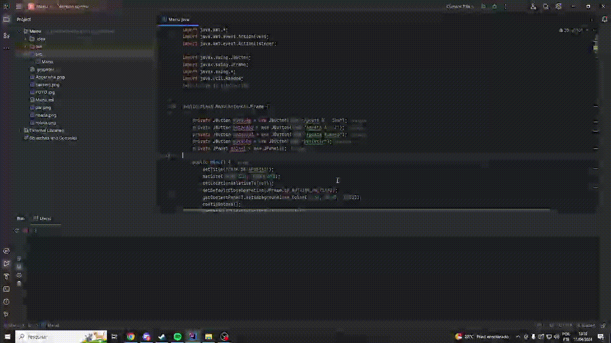

# Loto Facil
Este é um programa Java que simula uma casa de apostas. Ele oferece três opções de aposta para o usuário e a possibilidade de desistir a qualquer momento.

# Funcionalidades
Aposta 0 - 100: Permite ao usuário apostar em um número de 0 a 100 e verifica se ele ganhou com base em um sorteio aleatório.
Aposta A - Z: Permite ao usuário apostar em uma letra de A a Z e verifica se ele ganhou com base em um sorteio aleatório.
Aposta Número: Permite ao usuário apostar em um número e verifica se ele ganhou com base em se o número é par ou ímpar.
Desistir: Permite ao usuário desistir do jogo a qualquer momento.

# Como executar o programa
Certifique-se de ter o Java Development Kit (JDK) instalado em seu computador.
Clone este repositório para o seu ambiente local.
Abra o terminal ou prompt de comando e navegue até o diretório onde o repositório foi clonado.
Compile o arquivo Menu.java executando o seguinte comando:
"javac Menu.java"
Execute o programa compilado usando o seguinte comando:
"java Menu"
O programa será iniciado e a interface gráfica da casa de apostas será exibida.
# Tecnologias utilizadas
Linguagem de programação Java
Biblioteca Swing para interface gráfica
# Autor
Este programa foi desenvolvido por Miguel como parte de Linguagem de Programação.

# CODIGO RODANDO

